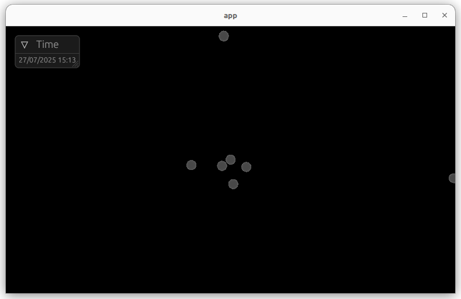

Decay is a Solar System simulator that uses newtonian physics. It's build around
[`bevy`](https://bevyengine.org/) and NASA JPL's data which is grabbed via
[`rhorizons`](https://crates.io/crates/rhorizons) crate.

Requirements
------------
To compile Decay you need a latest Rust stable and a couple of system packages.
On Ubuntu like systems:

    apt install build-essential libasound2-dev libudev-dev

